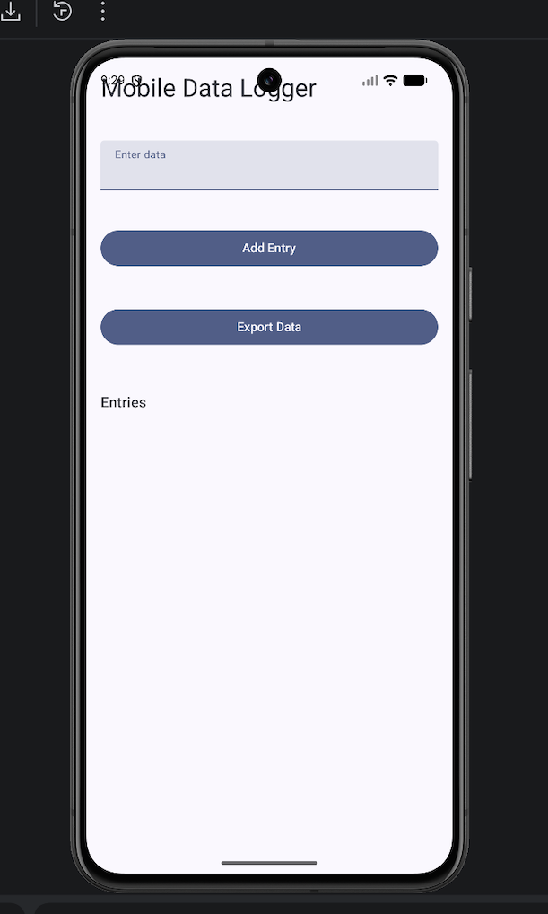
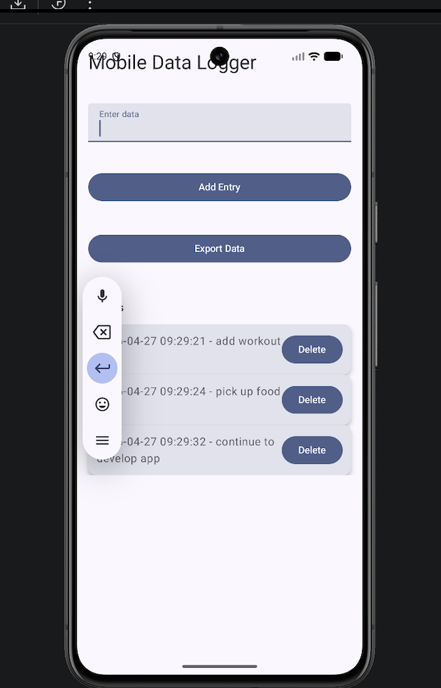

# Mobile Data Logger (Android)

## Overview
This is a mobile app built with Kotlin and Jetpack Compose that allows users to log and track timestamped data entries.

This project is part of my effort to learn mobile development and explore how mobile systems can be used for data collection and analysis.

## Features
- User input field
- Add entries with timestamps
- Scrollable list of entries
- Clean UI using Jetpack Compose
- Generate simple AI-style insights based on logged health, activity, and sleep data

## Tech Stack
- Kotlin
- Android Studio
- Jetpack Compose

## Progress
- Set up Android development environment
- Built basic UI
- Implemented user input and state management
- Added timestamped data entries
- Improved layout and UI

## AI Insight Feature (v1)

This version includes a basic "Generate Insight" feature that simulates AI-driven health insights based on logged data.

The current implementation uses simple rule-based logic, but is designed to be extended with generative AI models to provide personalized feedback on health, activity, and sleep patterns.

## Next Steps
- Save data permanently (local storage)
- Add export functionality (JSON/CSV)
- Improve UI/UX
- Explore iOS version

## Author
Abdallah El Hamawi

##

